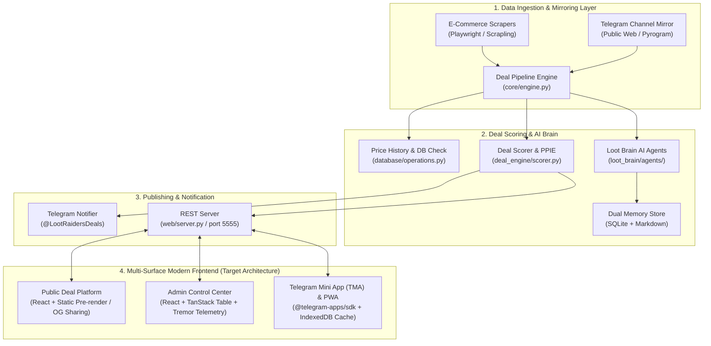

# Project Loot Raiders: Frontend Modernization Audit & Architecture Strategy (v2.0)
**Generated**: 2026-08-09  
**Target Repository**: [Project-Loot-Raiders](https://github.com/yogeshpadwal16/Project-Loot-Raiders)  
**Author**: Lead Frontend Architect & AI Engineering Co-Lead  

---

## 1. Executive Summary & System Architecture

### 1.1 Executive Summary
Project Loot Raiders is an existing production-grade e-commerce deal discovery and affiliate automation platform built on a Python 3.10 backend (`core/`, `deal_engine/`, `database/`, `plugins/`, `loot_brain/`). The current frontend consists of a legacy monolithic Vanilla JavaScript (`dashboard/index.js` - 107 KB) and CSS stylesheet (`dashboard/index.css` - 68 KB) served via `web/server.py` (`ThreadingHTTPServer` on port 5555).

This modernization strategy upgrades the frontend into a commercial-grade, multi-surface application ecosystem powered by **React 18 + TypeScript + Vite + Tailwind CSS v4 + TanStack Query v5**, without altering or breaking any backend Python services, scrapers, database schemas, or Telegram bots.

### 1.2 System Data Flow & Architecture Diagram

---

## 2. Migration Matrix

| Legacy File / Component | Purpose / Responsibilities | Status | Target Location | Priority | Risk Level |
| :--- | :--- | :--- | :--- | :--- | :--- |
| `dashboard/index.html` | Public deal feed, Loot Map modal, Scratch cards | **Rebuild** | `frontend/src/public/` | P0 | Low |
| `dashboard/index.js` (107 KB) | Monolithic deal rendering, voting, scratch cards, SSE listeners | **Replace** | `frontend/src/features/deals/` | P0 | Low |
| `dashboard/index.css` (68 KB) | Unstructured custom CSS | **Replace** | `frontend/src/theme/tokens.ts` + Tailwind v4 | P0 | Low |
| `dashboard/admin.html` (45 KB) | Admin control panel, selector matrix, scraper logs | **Rebuild** | `frontend/src/admin/` | P1 | Low |
| `dashboard/sw.js` | Service worker for offline PWA caching | **Rebuild** | `frontend/src/pwa/sw.ts` | P1 | Low |
| `dashboard/manifest.json` | PWA installation metadata | **Preserve / Adapt** | `frontend/public/manifest.json` | P2 | Zero |
| `web/server.py` | Python HTTP API server & static file host | **Preserve API / Update Host** | `web/server.py` | P0 | Low |
| `loot_brain/dashboard_api.py` | AI Brain FastAPI routes (`/api/v1/brain/*`) | **Preserve 100%** | `loot_brain/dashboard_api.py` | P0 | Zero |
| `knowledge_base/models.py` | SQLAlchemy Database Models | **Preserve 100%** | `knowledge_base/models.py` | P0 | Zero |

---

## 3. Backend API Inventory Matrix

| Route Endpoint | Method | Auth Required | Response Type | Realtime Requirement | TS Schema Status |
| :--- | :--- | :--- | :--- | :--- | :--- |
| `/api/status` | GET | Public | JSON (`ScraperStatus`) | Polling (10s) | To Create (`ScraperStatusSchema`) |
| `/api/deals` | GET | Public | JSON Array (`DealItem[]`) | SSE / Polling | To Create (`DealItemSchema`) |
| `/api/deals/history` | GET | Public | JSON (`PriceHistory[]`) | On Demand | To Create (`PriceHistorySchema`) |
| `/api/deals/public` | GET | Public | JSON Array (`PublicDeal[]`) | On Demand | To Create (`PublicDealSchema`) |
| `/api/analytics` | GET | Admin Token | JSON (`AnalyticsMetrics`) | Polling (30s) | To Create (`AnalyticsSchema`) |
| `/api/scraper/health` | GET | Public | JSON (`HealthStatus`) | Polling (15s) | To Create (`HealthStatusSchema`) |
| `/api/channel/growth` | GET | Public | JSON Array (`GrowthData[]`) | On Demand | To Create (`GrowthDataSchema`) |
| `/api/lootmap/events` | GET | Public | JSON Array (`MapEvent[]`) | Polling (15s) | To Create (`MapEventSchema`) |
| `/api/extension/match` | GET | Public | JSON (`ExtensionMatch`) | On Demand | To Create (`ExtensionMatchSchema`) |
| `/api/rewards/scratch` | GET | Public | JSON (`ScratchResult`) | Interactive | To Create (`ScratchResultSchema`) |
| `/api/clicks` | GET | Admin Token | JSON Array (`ClickLog[]`) | On Demand | To Create (`ClickLogSchema`) |
| `/api/logs` | GET | Admin Token | JSON Array (`string[]`) | Polling | String Array |
| `/api/logs/stream` | GET | Admin Token | `text/event-stream` (SSE) | **Live Stream** | Event Stream |
| `/api/deals/stream` | GET | Public | `text/event-stream` (SSE) | **Live Stream** | Event Stream |
| `/api/selectors` | GET / POST | Admin Token | JSON (`SelectorMatrix`) | On Demand | To Create (`SelectorSchema`) |
| `/api/settings` | GET / POST | Admin Token | JSON (`SettingsMap`) | On Demand | To Create (`SettingsSchema`) |
| `/api/scan` | POST | Admin Token | JSON (`ActionResponse`) | Instant | Action Response |
| `/api/toggle` | POST | Admin Token | JSON (`ActionResponse`) | Instant | Action Response |
| `/api/manual/crawl` | POST | Admin Token | JSON (`CrawlResponse`) | Instant | Crawl Response |
| `/api/manual/post` | POST | Admin Token | JSON (`PostResponse`) | Instant | Post Response |
| `/api/login` | POST | Public | JSON (`LoginResponse`) | Instant | Login Response |
| `/api/v1/brain/status` | GET | Public | JSON (`BrainStatus`) | Polling (15s) | To Create (`BrainStatusSchema`) |
| `/api/v1/brain/memories` | GET | Public | JSON Array (`MemoryEntry[]`) | On Demand | To Create (`MemoryEntrySchema`) |
| `/api/v1/brain/learning/policies` | GET | Public | JSON Array (`PolicyCandidate[]`) | Polling | To Create (`PolicyCandidateSchema`) |
| `/api/v1/brain/learning/policies/{id}/approve` | POST | Public / Token | JSON (`ApproveResponse`) | Instant | Approve Response |
| `/api/v1/brain/pipeline/process` | POST | Public / Token | JSON (`PipelineResult`) | Instant | Pipeline Result |

---

## 4. Component Selection & License Matrix

| Category | Tools / Libraries Evaluated | Selected Winner | License | Bundle Impact | Rationale |
| :--- | :--- | :--- | :--- | :--- | :--- |
| **Core Framework** | React 18 + TS, Vue 3, Svelte | **React 18 + TypeScript (Vite)** | MIT | ~45 KB gzipped | Max ecosystem compatibility, TanStack Query integration, Telegram Mini App support. |
| **Styling System** | Tailwind CSS v4, Styled-Components, Emotion | **Tailwind CSS v4** | MIT | ~12 KB CSS | Zero runtime overhead, utility-first design tokens, instant dark mode. |
| **Primitive Components** | Radix UI, Base UI, Headless UI | **Radix UI Primitives** | MIT | ~15 KB gzipped | Accessible, unstyled primitives for dialogs, tooltips, popovers, and drawers. |
| **Icons** | Lucide React, FontAwesome, Heroicons | **Lucide React** | ISC | Tree-shaken (~5 KB) | Clean, consistent SVG icon set for e-commerce, status badges, and admin metrics. |
| **Data Fetching & Cache** | TanStack Query v5, SWR, RTK Query | **TanStack Query v5** | MIT | ~12 KB gzipped | First-class SSE support, automatic retry, optimistic updates, and PersistQueryClient via IndexedDB. |
| **Data Grid & Tables** | TanStack Table v8, AG Grid, DataGrid | **TanStack Table v8** | MIT | ~14 KB gzipped | Headless, virtualized table rendering for large deal histories and click log telemetry. |
| **Charts & Analytics** | Tremor, Recharts, Chart.js | **Recharts + Tremor Primitives** | MIT | ~30 KB gzipped | SVG responsive price history trendlines and channel subscriber growth charts. |
| **Telegram SDK** | `@telegram-apps/sdk`, custom script | **`@telegram-apps/sdk-react`** | MIT | ~8 KB gzipped | Native haptics, theme params, back button integration, and main button controls for TMA. |

---

## 5. Core Web Vitals & Performance Targets

| Metric | Legacy Baseline (Estimated) | Target Threshold | Optimization Strategy |
| :--- | :--- | :--- | :--- |
| **Largest Contentful Paint (LCP)** | ~2.4s | **< 1.2s** | Pre-rendered static deal templates, WEBP/AVIF optimized images, font preloading. |
| **Interaction to Next Paint (INP)** | ~180ms | **< 80ms** | Virtualized lists for deal feeds, debounced search filters, zero main-thread blocking JS. |
| **Cumulative Layout Shift (CLS)** | 0.08 | **< 0.02** | Fixed-aspect ratio image containers, explicit skeleton loaders for initial feed state. |
| **First Input Delay (FID)** | ~90ms | **< 30ms** | Code splitting via Vite dynamic imports (`React.lazy`). |
| **JS Bundle Size Limit** | 107 KB (Uncompressed JS) | **< 75 KB (Gzipped total)** | Tree shaking, vendor chunking (`react-vendor`, `tanstack-vendor`, `recharts-vendor`). |

---

> [!NOTE]  
> **Phase 0 Audit Complete.**  
> This audit document has been generated and saved to [`FRONTEND_MODERNIZATION_AUDIT.md`](file:///C:/Users/yoges/Projects/Project-Loot-Raiders/FRONTEND_MODERNIZATION_AUDIT.md).  
> **Awaiting Human Approval before proceeding to Phase 1 (Design Tokens & Scaffolding).**
