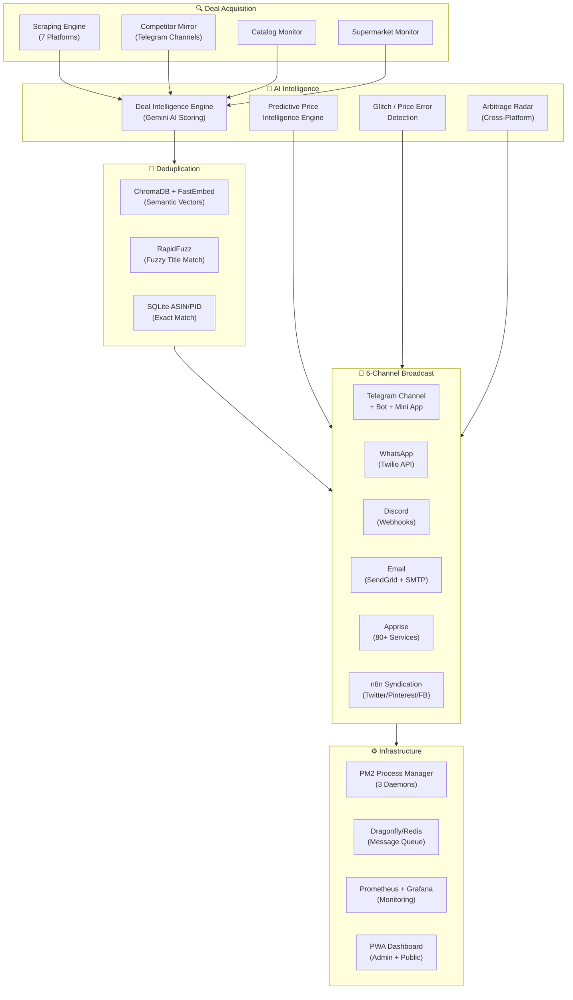

# 🏴‍☠️ Project Loot Raiders


**An intelligent, AI-powered deal discovery & automation platform** that scrapes, scores, and broadcasts the best shopping deals from **7+ Indian e-commerce platforms** — powered by **Google Gemini AI**, **ChromaDB semantic deduplication**, **6-channel notifications**, and a **real-time competitor deal mirroring engine**.

> Built to run 24/7 on an Oracle Cloud VPS with PM2, Docker services, Prometheus/Grafana monitoring, and a full-featured PWA dashboard.

---

## ⚡ Quick Start

```bash
# Clone the repository
git clone https://github.com/yogeshpadwal16/Project-Loot-Raiders.git
cd Project-Loot-Raiders

# Install dependencies
pip install -r requirements.txt

# Configure your API keys
cp .env.example .env
# Edit .env with your Telegram bot token, Gemini API key, Twilio creds, etc.

# Run the scraper
python loot_scraper.py
```

The dashboard will be available at:
- **Local development:** http://127.0.0.1:5555/
- **Production (Oracle Cloud VPS):** http://92.4.70.19:5555/

---

## 🎯 What It Does

Loot Raiders automatically discovers deals from **Amazon, Flipkart, Myntra, Ajio, Meesho, TataCliq, and JioMart**, scores them using a **multi-factor AI scoring engine**, deduplicates with **ChromaDB vector similarity**, and broadcasts the best ones across **6 channels** — Telegram, WhatsApp (Twilio), Discord, Email, Apprise (80+ services), and n8n social syndication — all while you sleep.

It also **mirrors competitor Telegram channels in real-time**, generates **premium deal card images** with price history sparklines, posts **daily news briefings** with live commodity rates, and runs a **festival greeting bot** with AI-generated posters.

---

## 🏗️ System Architecture



---

## ✨ Features

### 🔍 Multi-Platform Scraping Engine
- **7-platform support** — Amazon, Flipkart, Myntra, Ajio, Meesho, TataCliq, JioMart
- **Playwright + curl-cffi** browser automation with Akamai anti-bot bypass
- **Self-healing CSS selectors** — Gemini AI auto-repairs broken selectors at runtime
- **Multi-threaded concurrent scraping** for maximum throughput
- **Redirect URL expander** for shortened/affiliate links
- **OG image scraper** — OpenGraph fallback for missing product thumbnails
- **Scrapy crawler** — Alternative crawling engine for deep category pages

### 🤖 AI-Powered Deal Intelligence

| Engine | Description |
|--------|-------------|
| **Deal Intelligence Engine (DIE)** | Multi-factor weighted scoring (0–100): discount (35%), savings (20%), price history (25%), urgency (10%), trust (10%) |
| **Heuristic AI Ranker** | Category-aware desirability: HIGH_VALUE (laptop=+25, iphone=+28) vs LOW_VALUE (cable=-15, cover=-12), brand tier scoring, price sweet-spot analysis |
| **Predictive Price Intelligence (PPIE)** | Statistical buying advice badges: `ALL-TIME RECORD LOW`, `X% BELOW AVERAGE`, `PRICE NEAR PEAK`, `GOOD VALUE` with confidence scores |
| **Price Glitch Detection** | 3 heuristics: extreme discount ≥85%, historical drop ≥65% below avg, category-aware electronics detection |
| **Cancellation Risk Predictor** | Estimates price-error cancellation probability |
| **Click Popularity Bonus** | Real-time feedback loop: +2 per 10 clicks, capped at +15 |
| **LRU Score Cache** | 500-entry memoization cache for AI scores |

### 🔄 Competitor Deal Mirroring Engine
A **tgcf-inspired plugin architecture** that monitors rival Telegram channels and ingests their deals in real-time:

- **Plugin Pipeline** — 4 modular plugins process every incoming message:
  - `FilterPlugin` — Keyword blocklist/whitelist, min message length
  - `ReplacePlugin` — Regex-based competitor handle/promo cleanup
  - `OCRPlugin` — Tesseract OCR for image-embedded text extraction
  - `FormatPlugin` — Header/footer branding injection
- **Redis/Dragonfly Queue** — RPOPLPUSH reliable queue with thread-safe in-memory fallback
- **Multi-threaded Workers** — Configurable worker pool with Tenacity retry (3 attempts, exponential backoff)
- **9-step Pipeline** — Plugins → URL Extraction → Link Expansion → Landing Page Parse → Price Extraction → Deduplication → Price History → Scoring → Affiliate URL → Dispatch
- **Unrestricted Mirroring Mode** — Bypass all filters; only canonical product deduplication remains active

### 🧬 Semantic Deduplication
- **ChromaDB Vector Store** — Persistent embeddings with cosine similarity
- **FastEmbed** — BAAI/bge-small-en-v1.5 local model (no API calls)
- **5-layer deduplication stack:**
  1. In-flight concurrency lock (thread-safe, 5-min TTL)
  2. ChromaDB semantic vector similarity (configurable threshold)
  3. SQLite ASIN/PID exact match
  4. SQLite canonical URL match
  5. RapidFuzz fuzzy title matching (token_sort_ratio ≥ 85%)
- **Genuine Loot Deal Validator** — Frequency suppression (12h cooldown), daily post limits, recurring listing detection

### 📡 6-Channel Notification Broadcasting

| Channel | Integration | Details |
|---------|------------|---------|
| 📱 **Telegram** | python-telegram-bot + Telethon | Deal cards with inline BUY NOW keyboards, voice notes, real-time message updates |
| 💬 **WhatsApp** | Twilio REST API | Automated deal alerts via WhatsApp Business |
| 🟣 **Discord** | Webhook embeds | Rich embed cards with thumbnails and pricing |
| 📧 **Email** | SendGrid API + SMTP fallback | Beautiful HTML deal templates |
| 🔔 **Apprise** | 80+ services | Unified notification URIs (Slack, Pushbullet, Pushover, etc.) |
| 🔗 **n8n** | Webhook syndication | Auto-post to Twitter/X, Pinterest, Facebook |

### 🖼️ Premium Deal Card Image Generation
- **800×1000px cards** with slate-to-indigo gradient backgrounds
- **Platform badge** — Orange (Amazon), Blue (Flipkart)
- **Product image container** (660×440) with auto-download/resize
- **Sparkline price history overlay** on product thumbnail (green ↓, red ↑)
- **Verification banners** — `GLITCH PRICE ERROR` / `ALL-TIME LOW` / `PRICE DROP`
- **90-day price history graph** with gradient fill area
- **Hindi/Marathi typography** — 5 Devanagari font families (YatraOne, Amita, Ranga, Rozha, Tillana)

### 📰 Daily Briefing System
- **Dual PM2 daemon** (`loot-raiders-briefing`) running on separate schedule
- **Sindhudurg Regional News** — Scrapes eSakal + Google News RSS for Marathi local news
- **National Headlines** — Google News RSS (en-IN) with category classification
- **Live Commodity Rates** — Gold (22K/24K), Silver, Petrol, Diesel (Mumbai prices)
- **Marathi Unicode labels** — Context-emoji mapping (🎓 Education, 🚨 Crime, 🛕 Religion, 🏛️ Politics, 🌧️ Weather)
- **APScheduler** — Morning and evening dispatches with SQLite dedup

### 🎊 Festival Bot & Voice Alerts
- **Festival auto-detection** — Diwali, Ganesh Chaturthi, Holi, Sankashti, and more
- **Gemini Imagen** — AI-generated festival posters with Marathi greetings
- **Edge-TTS Voice Notes** — Neural voice synthesis (`en-IN-NeerjaNeural`) for high-score deals
- **Auto-posted** to Telegram channel as voice messages

### 🎯 Cross-Platform Arbitrage Radar
- Finds the **same product listed cheaper** on rival platforms
- RapidFuzz title matching (80% threshold) across 500 recent products
- Formats HTML comparison: *"Save ₹X here!"* or *"₹X cheaper on Y"*

### 📊 Dashboard & Analytics (PWA)
- **Public Deals Dashboard** — Premium neo-brutalist dark UI, deal cards, price history charts, search & filters
- **Admin Control Panel** — Settings management, selector editing, manual crawl/post, real-time logs, analytics
- **Progressive Web App** — Installable, offline-capable (service worker), app shortcuts
- **SSE Log Streaming** — Real-time `/api/logs/stream` for live monitoring
- **Channel Growth Analytics** — Subscriber telemetry over time
- **Click Tracking** — Platform breakdown, EPC metrics, geo density heatmap
- **Spotlight Deal of the Hour** widget

### 💰 Monetization & Affiliate System
- **Smart affiliate routing** — Amazon Associates, Cuelinks, EarnKaro
- **Auto-cart link generation** — Amazon `?add-to-cart=1` and Flipkart
- **Commission optimization** — Routes to highest-paying network per platform
- **Link cloaker** — `/go/<id>` redirect URLs with click tracking
- **Shlink integration** — Self-hosted URL shortener with velocity badges
- **Bank offer parser** — Effective price calculation with HDFC, SBI, ICICI card discounts

### 🎮 Gamification & Engagement
- **Loot Points** system with user scores and leaderboard
- **Scratch card rewards** — Random prize mechanics
- **Raffle/lottery system** with stats API
- **Referral tracking** — Referrer/referred logging with bonus points
- **Community deal voting** — Verify/expire with `DealVote` (3-vote threshold)
- **Deal expiration daemon** — Auto stock-checking and Telegram caption updates

### 🤖 Telegram Bot Commands
- Interactive bot listener with channel membership verification
- **Wishlist/Keyword Alerts:**
  - `/kwtrack <keyword> <max_price>` — Set price alerts (max 10/user)
  - `/kwremove <keyword>` — Remove alert
  - `/kwlist` — List active alerts
  - Word-boundary matching (prevents "phone" matching "earphone")
  - Auto-DM when matching deal is found

### 🛡️ Reliability & Operations
- **PM2 Process Management** — 3 daemons: scraper (1.2GB max), backup (12h cron), briefing (300MB max)
- **Docker Compose Stack** — Dragonfly (Redis), n8n, Prometheus, Grafana, Node Exporter
- **GitHub Actions CI/CD** — Automated scraping every 15 min (6 AM–2 AM IST)
- **VPS deployment scripts** — PowerShell (`deploy_to_vps.ps1`) & Bash (`setup_vps.sh`)
- **Dashboard API security** — Bearer token authentication
- **Zombie/stale deal cleanup** — Automatic pruning (`utils/zombie.py`)
- **SQLite WAL mode** — Concurrent read/write safety
- **Database backups** — Automated 12-hour backup rotation

---

## 🌐 REST API (30+ Endpoints)

<details>
<summary><strong>Click to expand full API reference</strong></summary>

### GET Endpoints

| Endpoint | Description |
|----------|-------------|
| `/api/status` | Scraper status, uptime, health metrics |
| `/api/deals` | All deals with forecasting, cancel risk, auto-cart, effective price |
| `/api/deals/public` | Public API with platform/score/limit filters |
| `/api/deals/history?id=` | 90-day price history for a product |
| `/api/tma/deals` | Telegram Mini App deals feed |
| `/api/analytics` | Clicks, platform breakdown, community stats, EPC metrics |
| `/api/selectors` | CSS selector matrix per platform |
| `/api/scraper/health` | Crawler health telemetry per platform |
| `/api/channel/growth` | Telegram subscriber growth data |
| `/api/clicks` | Click activity logs with WhatsApp stats |
| `/api/logs` | Last 100 execution log lines |
| `/api/logs/stream` | SSE real-time log streaming |
| `/api/settings` | Full settings configuration |
| `/api/config` | Public config subset |
| `/api/raffle/stats` | Raffle/lottery statistics |
| `/api/rewards/scratch` | Scratch card reward system |
| `/api/lootmap/events` | Live geo-targeted activity map data |
| `/api/extension/match` | Chrome Extension product matcher |
| `/api/redirect` | Click tracking redirect |
| `/api/push/subscribe` | PWA push notification subscription |
| `/go/<id>` | Link cloaker redirect |

### POST Endpoints

| Endpoint | Description |
|----------|-------------|
| `/api/login` | Dashboard authentication |
| `/api/scan` | Trigger manual scan cycle |
| `/api/toggle` | Toggle scraper on/off |
| `/api/selectors` | Update CSS selectors |
| `/api/settings` | Save settings configuration |
| `/api/manual/crawl` | Manual URL crawl |
| `/api/manual/post` | Manual deal post to Telegram |
| `/api/deals/delete` | Delete a deal |
| `/api/whatsapp/share` | Log WhatsApp share events |
| `/api/processes/cleanup` | Zombie process cleanup |

</details>

---

## 🗄️ Database Schema (16 Models)

<details>
<summary><strong>Click to expand SQLAlchemy models</strong></summary>

| Model | Purpose |
|-------|---------|
| `Product` | Core deal data — platform, title, image, URL, telegram_message_id, publication tracking |
| `PriceHistory` | Price, MRP, discount, verified low flag, deal score, timestamp |
| `ClickLog` | Product clicks — IP, user agent, timestamp |
| `SelectorMatrix` | CSS selectors per platform (card, title, link, image) |
| `AlertSubscription` | User price alert subscriptions |
| `DealVote` | Community verify/expire voting |
| `UserWalletCard` | User bank card preferences (HDFC, SBI, ICICI) |
| `UserScore` | Gamification points, vote count, referral count |
| `ReferralLog` | Referrer → referred tracking |
| `ChannelGrowthLog` | Subscriber count snapshots |
| `MirroredMessage` | Competitor mirror correlation tracking |
| `SourceChannel` | Monitored competitor channel registry |
| `ProcessingLog` | Pipeline stage/status logging |
| `SystemHealth` | System metric snapshots |
| `RetryHistory` | Failed pipeline retry tracking |
| `WishlistItem` | User keyword + target price alerts |

</details>

---

## 📁 Project Structure

```
Project-Loot-Raiders/
│
├── core/
│   └── engine.py                     # Main scraper loop & system state (46KB)
│
├── deal_engine/
│   ├── scorer.py                     # Gemini AI deal scoring (DIE + PPIE + Glitch)
│   ├── notifier.py                   # 6-channel notification engine (82KB)
│   ├── bot_listener.py               # Telegram bot command listener (1633 lines)
│   ├── deal_processor.py             # Deal metadata & URL processing
│   ├── channel_mirror.py             # Legacy competitor channel mirroring
│   ├── catalog_monitor.py            # Catalog URL monitoring
│   ├── supermarket_monitor.py        # Grocery/FMCG deal tracker
│   ├── arbitrage.py                  # Cross-platform price comparison
│   ├── expiration_daemon.py          # Auto stock-check & deal expiration
│   ├── festival_bot.py              # AI festival poster generator
│   ├── voice_generator.py            # Edge-TTS voice note synthesis
│   ├── wishlist.py                   # Keyword price alert system
│   └── mirroring/                    # ← Competitor Deal Mirroring Engine
│       ├── listener.py               #   Telethon channel monitor (32KB)
│       ├── processor.py              #   9-step pipeline processor
│       ├── redis_queue.py            #   RPOPLPUSH queue + in-memory fallback
│       ├── normalizer.py             #   Message normalization
│       ├── deduplicator.py           #   Mirror-specific dedup
│       ├── scheduler.py              #   APScheduler job management
│       ├── diagnostic.py             #   Pipeline health checks
│       ├── mirror_config.py          #   Mirror settings
│       ├── schemas.py                #   Pydantic message schemas
│       └── plugins/                  #   tgcf-inspired plugin system
│           ├── base.py               #     Abstract plugin base class
│           ├── filter.py             #     Keyword blocklist/whitelist
│           ├── replace.py            #     Competitor handle cleanup
│           ├── ocr.py                #     Tesseract image OCR
│           └── format.py            #     Brand header/footer injection
│
├── plugins/
│   ├── base_plugin.py                # Base retailer plugin interface
│   ├── amazon.py                     # Amazon scraper plugin
│   ├── flipkart.py                   # Flipkart scraper plugin
│   └── generic.py                    # Multi-retailer (Myntra, Ajio, Meesho, etc.)
│
├── dashboard/
│   ├── index.html                    # Public deals dashboard (PWA)
│   ├── admin.html                    # Admin control panel (45KB)
│   ├── index.css                     # Premium neo-brutalist dark UI (68KB)
│   ├── index.js                      # Dashboard logic & real-time updates (103KB)
│   ├── manifest.json                 # PWA manifest
│   ├── sw.js                         # Service worker (offline support)
│   └── offline.html                  # Offline fallback page
│
├── database/
│   ├── db_session.py                 # SQLAlchemy session management
│   ├── operations.py                 # CRUD operations & price verification (16KB)
│   └── chroma_db/                    # ChromaDB persistent vector store
│
├── knowledge_base/
│   └── models.py                     # 16 SQLAlchemy ORM models
│
├── web/
│   ├── server.py                     # REST API server (30+ endpoints, 1328 lines)
│   └── tma_router.py                 # Telegram Mini App API router
│
├── utils/
│   ├── playwright_adapter.py         # Browser automation engine (13KB)
│   ├── parser.py                     # Price/URL/text parsing
│   ├── affiliate.py                  # Affiliate link routing & auto-cart
│   ├── image_generator.py            # 800×1000 premium deal card generator
│   ├── deduplicator.py               # 5-layer deduplication engine (15KB)
│   ├── semantic_dedup.py             # ChromaDB + FastEmbed vector search
│   ├── zombie.py                     # Stale deal & process cleanup
│   ├── cache.py                      # LRU caching utilities
│   ├── og_scraper.py                 # OpenGraph image fallback scraper
│   ├── bank_offers.py                # Bank card discount parser
│   ├── ab_testing.py                 # A/B template variant testing
│   ├── shlink.py                     # Self-hosted URL shortener
│   ├── proxy_validator.py            # Proxy pool validator
│   ├── router.py                     # URL routing utilities
│   └── scrapy_crawler.py             # Alternative Scrapy crawl engine
│
├── config/
│   ├── settings.py                   # Settings loader (252 lines)
│   └── catalog_urls.json             # Monitored catalog URLs
│
├── scripts/
│   ├── deploy_to_vps.ps1             # VPS deployment (Windows → Oracle Cloud)
│   ├── deploy_services_docker.ps1    # Docker service stack deployment
│   ├── deploy_shlink_docker.ps1      # Shlink URL shortener deployment
│   ├── setup_vps.sh                  # VPS setup (Linux)
│   ├── loop_runner.py                # GitHub Actions loop runner
│   ├── generate_session_string.py    # Telethon session generator
│   ├── migrate_json_to_db.py         # JSON → SQLite migration
│   ├── backup_db.py                  # Database backup utility
│   ├── update_twilio.py              # Secure Twilio credential updater
│   └── ...                           # + query, flush, dump utilities
│
├── tests/
│   ├── test_loot_raiders.py          # Core tests (693 lines)
│   ├── test_fixed_functions.py       # Regression tests
│   ├── test_plugins.py               # Mirroring plugin tests
│   ├── test_daily_briefing.py        # Briefing system tests
│   ├── test_proxy_validator.py       # Proxy validation tests
│   └── test_semantic_dedup.py        # ChromaDB dedup tests
│
├── daily_briefing.py                 # News briefing engine (534 lines)
├── main_briefing.py                  # Briefing PM2 orchestrator
│
├── n8n/
│   └── deal_syndication_workflow.json  # Twitter/Pinterest/FB automation
│
├── docker/
│   ├── docker-compose-services.yml   # Dragonfly, n8n, Prometheus, Grafana
│   ├── prometheus.yml                # Metrics scraping config
│   └── grafana/                      # Grafana dashboard provisioning
│
├── .github/workflows/
│   └── scrape_deals.yml              # CI/CD: every 15 min, 6 AM–2 AM IST
│
├── Dockerfile                        # App containerization
├── ecosystem.config.js               # PM2 process manager (3 daemons)
├── settings.json                     # Runtime configuration
├── selectors.json                    # CSS selectors per platform
├── requirements.txt                  # 81 Python dependencies
└── README.md
```

---

## ⚙️ Configuration

### Environment Variables (`.env`)

```env
# Telegram
TELEGRAM_API_ID=your_api_id
TELEGRAM_API_HASH=your_api_hash
TELEGRAM_BOT_TOKEN=your_bot_token
TELEGRAM_STRING_SESSION=your_session_string

# AI
GEMINI_API_KEY=your_gemini_key

# WhatsApp (Twilio)
TWILIO_ACCOUNT_SID=your_twilio_sid
TWILIO_AUTH_TOKEN=your_twilio_token
TWILIO_WHATSAPP_FROM=whatsapp:+14155238886
WHATSAPP_TO=whatsapp:+91XXXXXXXXXX

# Dashboard
DASHBOARD_SESSION_TOKEN=your_admin_token

# Optional
DISCORD_WEBHOOK_URL=your_discord_webhook
SENDGRID_API_KEY=your_sendgrid_key
```

### `settings.json` Highlights

| Setting | Description |
|---------|-------------|
| `telegram_bot_token` | Telegram Bot API token |
| `telegram_chat_id` | Channel/group chat ID |
| `gemini_api_key` | Google Gemini AI API key |
| `amazon_tag` | Amazon Associates affiliate tag |
| `flipkart_affid` | Flipkart affiliate ID |
| `cuelinks_pub_id` | Cuelinks publisher ID |
| `earnkaro_pub_id` | EarnKaro publisher ID |
| `notification_uris` | Apprise URIs for 80+ services |
| `min_discount` | Minimum discount % threshold (default: 30%) |
| `min_deal_price` | Minimum deal price filter (default: ₹149) |
| `blocklist_keywords` | Keywords to filter out junk deals |
| `scoring_rules` | AI scoring weights and thresholds |

---

## 🐳 Docker Deployment

### Application

```bash
docker build -t loot-raiders .
docker run -d --name loot-raiders -p 5555:5555 --env-file .env loot-raiders
```

### Infrastructure Stack (Dragonfly + n8n + Monitoring)

```bash
cd docker
docker compose -f docker-compose-services.yml up -d
```

This starts:
- **Dragonfly** (Redis-compatible) — Port 6379
- **n8n** (Workflow automation) — Port 5678
- **Prometheus** (Metrics) — Port 9090
- **Grafana** (Dashboards) — Port 3000
- **Node Exporter** (Host metrics) — Port 9100

---

## 🚀 VPS Deployment (Oracle Cloud)

```bash
# From Windows (PowerShell) — deploys archive via SSH
powershell -File scripts/deploy_to_vps.ps1

# Linux VPS initial setup
chmod +x scripts/setup_vps.sh
./scripts/setup_vps.sh

# PM2 process management
pm2 start ecosystem.config.js
pm2 save
```

**PM2 runs 3 daemons:**

| Process | Description | Memory Limit | Schedule |
|---------|-------------|-------------|----------|
| `loot-raiders` | Main scraper + API + dashboard | 1.2 GB | Daily restart at 4 AM |
| `loot-raiders-backup` | Database backup | — | Every 12 hours |
| `loot-raiders-briefing` | News briefing engine | 300 MB | Morning + Evening |

---

## 🧪 Testing

```bash
# Run full test suite (67 tests)
python run_full_audit.py

# Or via pytest directly
python -m pytest tests/ -v

# Individual test modules
python -m pytest tests/test_loot_raiders.py -v      # Core functionality
python -m pytest tests/test_plugins.py -v            # Mirroring plugins
python -m pytest tests/test_semantic_dedup.py -v     # ChromaDB dedup
python -m pytest tests/test_daily_briefing.py -v     # Briefing system
```

---

## 🛠️ Tech Stack

| Component | Technology |
|-----------|-----------|
| **Language** | Python 3.10+ |
| **Browser Automation** | Playwright 1.61 + curl-cffi 0.15 (anti-bot) |
| **Database** | SQLAlchemy 2.0 + SQLite (WAL mode) |
| **Vector Store** | ChromaDB ≥0.5 + FastEmbed (BAAI/bge-small-en-v1.5) |
| **Message Queue** | Redis / Dragonfly (with in-memory fallback) |
| **AI** | Google Gemini API (scoring, selectors, Imagen) |
| **Telegram** | Telethon 1.44 (MTProto) + python-telegram-bot 22.8 + Pyrogram 2.0 |
| **WhatsApp** | Twilio REST API |
| **Voice** | Edge-TTS 6.1 (Microsoft Neural TTS) |
| **Image Gen** | Pillow 10.4 (deal cards, sparklines, festival posters) |
| **Fuzzy Match** | RapidFuzz 3.14 |
| **Data** | Pandas 2.3, NumPy 2.2, Pydantic 2.13 |
| **Notifications** | Apprise ≥1.8 (80+ services) |
| **Scheduling** | APScheduler 3.11, aiolimiter |
| **Dashboard** | HTML5 + CSS3 + Vanilla JS (103KB) |
| **Charts** | Chart.js |
| **Typography** | Google Fonts (Outfit, Fira Code) + 5 Devanagari families |
| **Icons** | Font Awesome 6 |
| **CI/CD** | GitHub Actions (15-min cron, 6 AM–2 AM IST) |
| **Container** | Docker + Docker Compose |
| **Process** | PM2 (3 daemons) |
| **Monitoring** | Prometheus + Grafana + Node Exporter |
| **Automation** | n8n (social syndication workflows) |
| **Scraping** | Scrapy ≥2.11, BeautifulSoup4, selectolax, lxml |

---

## 🗺️ Roadmap

- [x] Multi-platform scraping (7 platforms)
- [x] Gemini AI deal scoring (DIE + PPIE + Glitch Detection)
- [x] Self-healing CSS selectors
- [x] Telegram broadcasting, bot & Mini App
- [x] WhatsApp alerts via Twilio
- [x] Discord, Email & Apprise notifications
- [x] n8n social media syndication (Twitter/Pinterest/FB)
- [x] Price history tracking with sparkline charts
- [x] Semantic deduplication (ChromaDB + FastEmbed)
- [x] Competitor deal mirroring (tgcf-inspired plugins)
- [x] Premium deal card image generation
- [x] Cross-platform arbitrage radar
- [x] Daily news briefing (Sindhudurg + National + Commodity Rates)
- [x] Festival bot with AI-generated posters
- [x] Edge-TTS voice deal alerts
- [x] Web dashboard with admin panel (PWA)
- [x] Affiliate link routing & auto-cart
- [x] Link cloaker & Shlink URL shortener
- [x] Gamification (points, scratch cards, raffles, referrals)
- [x] Community deal voting & expiration daemon
- [x] Wishlist/keyword price alerts
- [x] Bank offer effective price calculator
- [x] Docker infrastructure (Dragonfly, Prometheus, Grafana)
- [x] GitHub Actions CI/CD
- [x] PM2 process management (3 daemons)
- [x] VPS deployment automation
- [x] A/B template testing
- [x] Channel growth analytics
- [x] Chrome Extension API
- [ ] Push notifications (PWA Web Push)
- [ ] Public deal distribution API
- [ ] ML-based personalized deal ranking

---

## 🤝 Contributing

Contributions are welcome!

1. Fork the repository
2. Create a feature branch (`git checkout -b feature/amazing-feature`)
3. Commit your changes (`git commit -m 'feat: add amazing feature'`)
4. Push to the branch (`git push origin feature/amazing-feature`)
5. Open a Pull Request

---

## 📄 License

This project is licensed under the MIT License.

---

## 👨‍💻 Author

**Yogesh Padwal**

GitHub: [yogeshpadwal16](https://github.com/yogeshpadwal16)

---

⭐ **If you find this project useful, consider giving it a Star!**

<!-- Cloudflare Pages Production Deployment Sync -->
