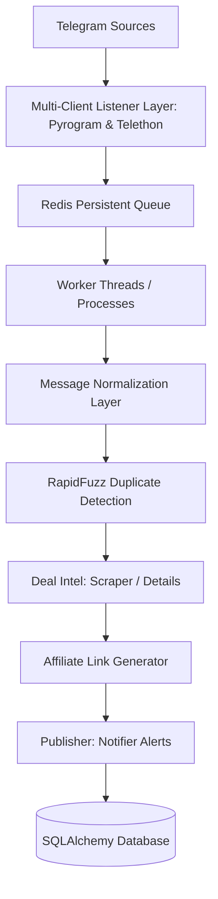

# 🚀 Modular Deal Mirroring Engine

This directory contains the production-ready, modular, and fault-tolerant **Deal Mirroring Engine** for Project Loot Raiders. It replaces the old legacy monolithic Telethon listener with a decoupled, worker-based processing pipeline.

---

## 📁 Architecture Overview

---

## 🧩 Pipeline Components

### 1. Multi-Client Listener Layer (`listener.py`)
* **Primary Client:** Pyrogram (faster, modern asynchronous client)
* **Fallback Client:** Telethon (robust compatibility backup)
* **Health Monitoring:** Background task checks client connection states and automatically triggers failover without loss of event capture.

### 2. Redis Message Queue (`queue.py`)
* De-couples Telegram event capturing from heavy web scraping / Playwright operations.
* Avoids `FloodWait` blocks and OOM crashes by processing messages sequentially/concurrently via workers.
* Support for persistence, retries, and clean restart states.

### 3. Normalization Layer (`normalizer.py`)
* Maps incoming Telegram messages (from both Telethon and Pyrogram) into a single, unified Python schema:
  * Raw Text & Caption
  * Extracted Links & Inline Keyboard Buttons
  * Sender Metadata
  * Media Attributes (Photos, Videos)

### 4. Semantic Deduplicator (`deduplicator.py`)
* Employs **RapidFuzz** string distance similarity mapping.
* Matches deals even if they have minor variation in emojis, spacing, coupon codes, link shortening variations, or affiliate tracking parameters.

### 5. Automated Scheduler (`scheduler.py`)
* Runs periodic cleanup, health-check dumps, session validations, and growth statistics logs using **APScheduler**.
